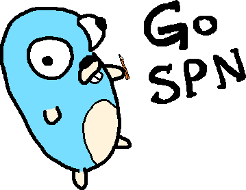

GoSPN
=====

[](https://travis-ci.org/RenatoGeh/gospn)
[](https://goreportcard.com/report/github.com/renatogeh/gospn)
[](https://godoc.org/github.com/RenatoGeh/gospn)



My crude (and slightly terrifying) rendition of Renee French's Go [Gopher](https://blog.golang.org/gopher) writing what's on his mind.

An implementation of Sum-Product Networks (SPNs) in Go
------------------------------------------------------

### Overview

Sum-Product Networks (SPNs) are deep probabilistic graphical models
(PGMs) that compactly represent tractable probability distributions.
Exact inference in SPNs is computed in time linear in the number of
edges, an attractive feature that distinguishes SPNs from other PGMs.
However, learning SPNs is a tough task. There have been many advances in
learning the structure and parameters of SPNs in the past few years. One
interesting feature is the fact that we can make use of SPNs' deep
architecture and perform deep learning on these models. Since the number
of hidden layers not only doesn't negatively impact the tractability of
inference of SPNs but also augments the representability of this model,
it is very much desirable to continue research on deep learning of SPNs.

This project aims to provide a simple implementation of structural
learning of SPNs. We seek to follow the paper *Learning the Structure of
Sum-Product Networks* by Robert Gens and Pedro Domingos (ICML 2013) and
implement our own version of structural learning based on the schema
provided by the article.

Our objective is not only educational - in the sense that we wish to
learn more about the peculiarities of SPNs - but also documentational,
as we also intend on documenting and recording what we have learned in a
simpler, clearer way then how it is currently written in literature.

A thorough analysis on our implementation can be found at
(<https://github.com/RenatoGeh/gospn/blob/master/doc/analysis/analysis.pdf>).

### Usage

To run GoSPN, we must complete a few steps:

1. Prepare the dataset:
  - Let `ds` be your dataset's name.
  - Create a new directory `/data/ds`, where root is the root of the
    GoSPN package.
  - Each subdirectory inside `/data/ds` represents a different class.
  - For example: if we have three classes, `dog`, `cat` and `mouse`,
    then we might have three subdirectories inside `/data/ds` named
    `dog`, `cat` and `mouse`.
  - Copy your class instances into `/data/ds/classname`.
2. Compile the dataset into a `.data` file:
  - If the dataset is an image, take note of the dimensions and max
    value pixels take.
  - Let `w` and `h` be the width and height of the images, and `m` be
    the max value.
  - Compile the data with `go run main.go -mode=data -width=w -height=h
    -max=m -dataset=ds`
  - This will generate a `.data` file inside `/data/ds/all/`. By default
    it is named `all.data`.
3. Run a job by running GoSPN with the following syntax.


```
Usage:
  go run main.go [-p] [-rseed] [-clusters] [-iterations] [-concurrents]
  [-dataset] [-width] [-height] [-max] [-mode] [-pval] [-eps] [-mp] [-v]
Arguments:
  p           - is the partition in the interval (0, 1) to be used for
                cross-validation. If ommitted, p defaults to 0.7.
  rseed       - the seed to be used when choosing which instances to be used
                as train and which to be used as test set. If ommitted, rseed
                defaults to -1, which chooses a random seed according to the
                current time.
  clusters    - how many k-clusters to be used during training on instance
                splits. If clusters = -1, then use DBSCAN. Else if
                clusters = -2, then use OPTICS. Else, if clusters > 0,
                then use k-means clustering. By default, clusters is set
                to -1.
  iterations  - how many iterations to be run when running a
                classification job. This allows for better, more general
                and randomized results, as some test/train partitions may
                become degenerated.
  concurrents - GoSPN makes use of Go's native concurrency and is able
                to run on multiple cores in parallel. Argument concurrents
                defines the number of concurrent jobs GoSPN should run
                at most. If concurrents <= 0, then concurrents = nCPU,
                where nCPU is the number of CPUs the running machine has
                available. By default, concurrents = -1.
  dataset     - name of the dataset to be parsed or compiled. Setting
                -mode=data will compile data. Ommitting -mode or setting
                -mode to something different than data will either run
                completion or classification.
  width       - width of the images to be classified or completed.
  height      - height of the images to be classified or completed.
  max         - maximum pixel value the images can take.
  mode        - whether to convert a directory structure into a data
                file (data), run an image completion job (cmpl) or a
                classification job (class).
  pval        - the significance value for the independence test.
  eps         - the epsilon minimum distance value for DBSCAN.
  mp          - the minimum points density for DBSCAN.
  v           - Verbose mode.
```

Running `go run main.go -help` shows the help page.

#### For step 3 to run a classification job:

1. Choose a partition value `p` such that `0 < p < 1`. For instance,
   `p=0.8`.
2. Choose an `rseed` value. For instance, `rseed=-1`.
3. Choose a `clusters` value (k-means with `clusters` clusters, DBSCAN
   or OPTICS). For instance, `clusters=-1`.
4. Choose the number of iterations `iterations`. For instance,
   `iterations=5`.
5. Set your dataset name and image width, height and max value
   (`-dataset`, `-width`, `-height` and `-max`).
6. Run GoSPN with `-mode=class`.
7. Example: `go run main.go -p=0.8 -rseed=-1 -clusters=-1 -iterations=5
   -dataset=caltech -width=150 -height=65 -max=256 -mode=class`.

#### For step 3 to run an image completion job:
1. Set your dataset name and image width, height and max value
   (`-dataset`, `-width`, `-height` and `-max`).
2. Run GoSPN with `-mode=cmpl`.
3. Example: `go run main.go -mode=cmpl -dataset=olivetti_3bit -width=56
   -height=46 -max=8`.

### Dependencies

GoSPN is built in Go. Go is an open source language originally developed
at Google. It's a simple yet powerful and fast language built with
efficiency in mind. Installing Go is easy. Pre-compiled packages are
available for FreeBSD, Linux, Mac OS X and Windows for both 32 and
64-bit processors. For more information see <https://golang.org/doc/install>.

The dependencies below can be considered "optional", in that the user
can avoid using using them if one wishes so.

#### GNU GSL Scientific Library (recommended)

GoSPN uses GNU GSL to compute the cumulative probability function

```
Pr(X^2 <= chi), X^2(df)
```

For the independence test (`utils/indep/indtest.go`). A builtin
Chi-Square function is already present in `utils/indep/indtest.go`
under the name of `Chisquare`. However `Chisquare` has worse numerical
error when compared to its GSL equivalent `ChiSquare` (see
`utils/indep/chisq.go`).

For information on how to compile and install GNU GSL, see
<https://www.gnu.org/software/gsl/>.

If you do not wish to install GNU GSL, simply rename `ChiSquare` in file
`utils/indep/indtest.go` to `Chisquare`.

GoSPN uses Go's `cgo` to run C code inside Go. File
`utils/indep/chisq.go` contains the wrapper function `ChiSquare`
that calls `gsl_cdf_chisq_P` from `gsl/gsl_cdf.h`.

#### graph-tool (optional)

Graph-tool is a Python module for graph manipulation and drawing. Since
the SPNs we'll generate with this algorithm may have thousands of nodes
and hundreds of layers, we need a fast and efficient graph drawing tool
for displaying our graphs. Since graph-tool uses C++ metaprogramming
extensively, its performance is comparable to a C++ library.

Graph-tool uses the C++ Boost Library and can be compiled with OpenMP, a
library for parallel programming on multiple cores architecture that may
decrease graph compilation time significantly.

Compiling graph-tool can take up to 80 minutes and 3GB of RAM. If you do
not plan on compiling the graphs GoSPN outputs, it is highly recommended
that you do not install graph-tool.

Subdependencies and installation instructions are listed at
<https://graph-tool.skewed.de/download>.

### Compiling and Running GoSPN

To get the source code through Go's `go get` command, run the following
command:

```
$ go get github.com/RenatoGeh/gospn
```

This should install GoSPN to your $GOPATH directory. Compiling the code
is easy. First go to the GoSPN source dir.

```
$ cd $GOPATH/github.com/RenatoGeh/gospn/
```

To compile and run:

```
$ go run main.go <args>
```

Where `args` is a list of arguments. See Usage for more information.

### Updating GoSPN

To update GoSPN, run:

```
go get -u github.com/RenatoGeh/gospn
```

### Code and Docs Organization

In this section we describe the general layout that we intend to follow
for both code and documentation. For more information on SPNs, look for
the documentation present in this repository under directory `/doc`.

#### Code

Code documentation can be found at <https://godoc.org/github.com/RenatoGeh/gospn>.

#### Documentation

An analysis on our implementation can be found at
<https://github.com/RenatoGeh/gospn/blob/master/doc/analysis/analysis.pdf>.

### Datasets

We use the following datasets:

* Custom hand drawn numerical digits dataset
* Olivetti Faces Dataset by AT&T Laboratories Cambridge
* Caltech101: L. Fei-Fei, R. Fergus and P. Perona. *Learning generative visual models
  from few training examples: an incremental Bayesian approach tested on
  101 object categories.* IEEE. CVPR 2004, Workshop on Generative-Model
  Based Vision. 2004

### Results

In our [analysis'](https://github.com/RenatoGeh/gospn/blob/master/doc/analysis/analysis.pdf)
experiments section we show some results from the three datasets
enumerated above. We include some graphs and image completions here.
More images completions can be found at
[/results/olivetti_3bit/](https://github.com/RenatoGeh/gospn/tree/master/results/olivetti_3bit).
We also ran experiments on a modified Caltech-101 dataset due to memory
constraints. Read the analysis document (Experiments section) for more information.

#### Image classifications


#### Image completions with prior face knowledge


#### Image completions without prior face knowledge


### Further work

This is a TODO list:

* Implement discriminative learning based on the paper *Discriminative
  Learning of Sum-Product Networks* (R. Gens, P. Domingos) NIPS 2012
* Implement language modelling SPN based on the paper *Language
  Modelling with Sum-Product Networks* (Cheng *et al*) INTERSPEECH 2014
